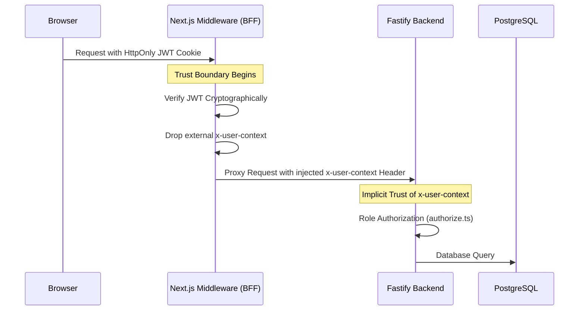
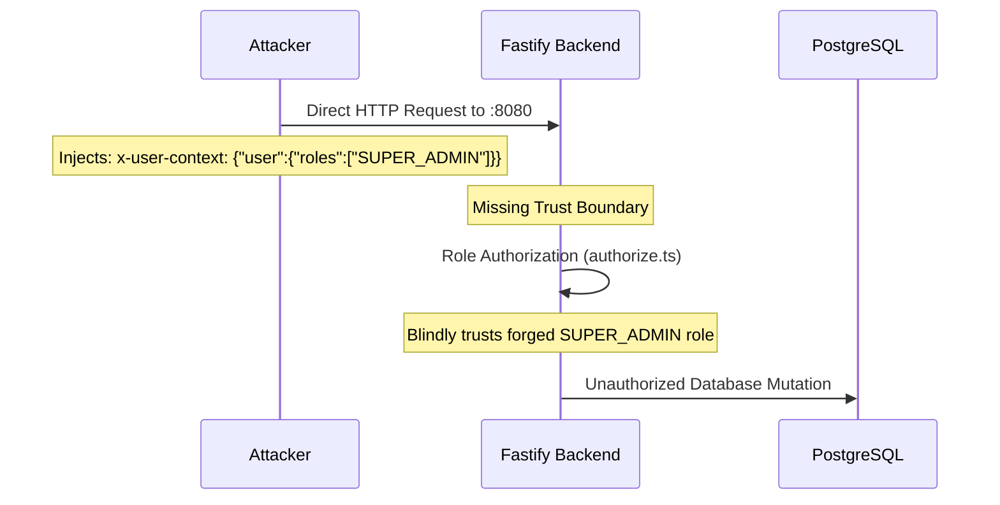

# Deployment Security Contract

## 1. Repository Facts

Based entirely on repository evidence and runtime verification, the following are verified facts about the application architecture:

*   **Next.js BFF:** Issues JWTs (via `jose` in `POST /api/auth/session`) and intercepts proxy requests (`/api/proxy/*`) via `middleware.ts`.
*   **Next.js Middleware:** Exclusively verifies JWTs and injects the `x-user-context` header into upstream proxy requests.
*   **Fastify Backend:** Hardcoded to listen on host interfaces determined by `HOST` from `src/config/env.ts` and `src/server.ts`.
*   **Authentication Delegation:** Fastify relies strictly on upstream authentication. The native `FirebaseIdentityAdapter` is explicitly implemented as an error-throwing placeholder.
*   **Identity Extraction:** Fastify's `authenticate.ts` and `SocketAuthenticator.ts` trust and parse the plaintext `x-user-context` HTTP header.
*   **Authorization:** Authorization is performed by Fastify (`authorize.ts`) using the roles contained in the `x-user-context` supplied by the trusted upstream gateway.
*   **JWT Verification:** The Fastify repository contains zero JWT parsing libraries or cryptographic verification logic.

---

## 2. Trust Boundary

The intended architectural trust boundary, where identity is cryptographically verified before being forwarded as trusted context.



---

## 3. Threat Boundary

The realized attack path if deployment topology fails to enforce the trust boundary. If Fastify is deployed in an environment where clients can directly reach its listening interface, the delegated authentication model can be bypassed.



---

## 4. Trust Assumptions

For the backend to remain secure, the deployment architecture strictly assumes:

*   incoming `x-user-context` originated from a trusted gateway
*   gateway stripped externally supplied `x-user-context`
*   gateway verified JWT
*   gateway injected roles
*   transport between gateway and backend is trusted

These assumptions are required for correctness.

---

## 5. Operational Requirements

The following requirements represent deployment assumptions necessary to enforce the trust boundary. These are not repository facts, but operational mandates for any production deployment:

*   reverse proxy
*   firewall
*   ingress
*   VPC
*   internal networking
*   TLS
*   header stripping
*   Docker networking

---

## 6. Security Classification

**Safe Only Behind Trusted Gateway**

**Explanation:** 
The application is intentionally architected around delegated authentication. Its correctness depends on infrastructure enforcing the trust boundary. The repository alone cannot prove whether production infrastructure satisfies those assumptions. 

The repository does not contain evidence that Fastify is protected by infrastructure. If Fastify is deployed with direct external reachability, the delegated trust model can be bypassed.

---

## 7. Out-of-Scope Security Evidence

The repository explicitly does not contain evidence for infrastructure-level configuration. The following networking and security layers cannot be audited from source code:

*   firewall rules
*   cloud security groups
*   VPC
*   load balancer
*   ingress
*   reverse proxy
*   WAF
*   zero trust networking

---

## 8. Architecture Invariants

These invariants must never change without redesigning the authentication model:

*   The supported production architecture does not permit browsers to communicate directly with Fastify.
*   Browser never creates `x-user-context`.
*   Only the trusted gateway creates `x-user-context`.
*   Fastify never verifies JWTs.
*   Fastify never receives browser cookies.
*   JWT verification exists only in the gateway.
*   Authorization exists only in Fastify.
*   Identity and authorization remain separated.

---

## 9. Authentication Contract (Frozen)

```text
Browser
↓
Next.js Gateway
↓
JWT Verification (role: string)
↓
Header Mapping (roles: string[])
↓
Injected x-user-context
↓
Fastify
↓
Authorization (roles check)
↓
Database
```

### Canonical Data Structures

#### 1. JWT Payload (Gateway Session Token)
- **Algorithm:** `HS256`
- **Issuer (`iss`):** `"legxi-gateway"`
- **Audience (`aud`):** `"legxi-fastify"`
- **Role Field:** Single string (`role: string`, e.g. `"ADMIN"`, `"USER"`)
- **Permissions:** Never embedded.
- **Lifetime:** 15 minutes (`exp - iat = 900`).

```json
{
  "iss": "legxi-gateway",
  "aud": "legxi-fastify",
  "sub": "<userId>",
  "email": "<email>",
  "role": "ADMIN",
  "iat": 1785925463,
  "exp": 1785926363,
  "jti": "<uuid>"
}
```

#### 2. Gateway Injected Header (`x-user-context`)
- **Injection Point:** Next.js Gateway (`middleware.ts`)
- **Roles Field:** Array of strings (`roles: string[]`, e.g. `["ADMIN"]`)
- **Conversion:** Next.js Gateway converts JWT `role` string to `roles: [role]` array before upstream injection.

```json
{
  "user": {
    "id": "<userId>",
    "email": "<email>",
    "roles": ["ADMIN"]
  }
}
```

**Invariant:**
No browser-originated `x-user-context` is ever considered authoritative. Gateway strips all external incoming `x-user-context` headers.

Every future authentication implementation must preserve this boundary unless a formal architecture migration occurs.

---

## 10. ADR Trigger

Any change to the following components requires a new ADR before implementation:

*   JWT ownership
*   gateway ownership
*   `x-user-context`
*   authentication provider
*   cookie model
*   websocket authentication
*   trust boundary

---

## 11. Final Approval

**Architecture Review:**
PASS

**Repository Review:**
PASS

**Infrastructure Review:**
OUT OF SCOPE

**Phase 5:**
APPROVED TO BEGIN
