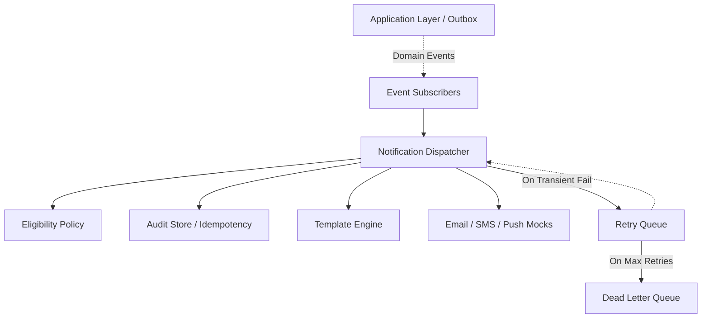

# LEGXI Enterprise Live Auction Platform
## Phase 2.17 - Notification Engine & Event Dispatch Report

### 1. Architecture Compliance
**PASS**. The Notification Engine has been strictly implemented as a reactive side-effect processor.
No business logic directly references notifications. Domain models, AuctionEngine, Payment Engine, and the Repository architecture remain completely untouched. The Notification Engine listens strictly to domain events (e.g. `onAuctionCreated`, `onOutbid`).

### 2. Files Created
#### Application Ports (Interfaces)
- `src/notifications/ports/IEmailProvider.ts`
- `src/notifications/ports/ISmsProvider.ts`
- `src/notifications/ports/IPushProvider.ts`
- `src/notifications/ports/INotificationAuditStore.ts`
- `src/notifications/types.ts`

#### Core Engine
- `src/notifications/engine/NotificationDispatcher.ts`
- `src/notifications/engine/TemplateEngine.ts`
- `src/notifications/policies/NotificationEligibilityPolicy.ts`

#### Resilience & Queueing
- `src/notifications/queue/NotificationRetryQueue.ts`
- `src/notifications/queue/NotificationDeadLetterQueue.ts`

#### Event Subscribers
- `src/notifications/subscribers/AuctionEventSubscriber.ts`
- `src/notifications/subscribers/BidEventSubscriber.ts`

#### Infrastructure Adapters (Mocks)
- `src/infrastructure/adapters/notifications/MockProviders.ts`
- `src/infrastructure/adapters/notifications/MockAuditStore.ts`

### 3. Key Design Choices & Refinements Implemented
* **Outbox Compatibility**: The `NotificationDispatcher` expects raw primitives (`correlationId`, `eventId`, `NotificationPayload`) making it perfectly pluggable with a future Transactional Outbox pattern that polls the DB and feeds events directly to the dispatcher.
* **Notification Lifecycle**: Tracked explicitly via `NotificationState` (`PENDING` -> `QUEUED` -> `PROCESSING` -> `SENT` / `FAILED` / `DLQ`).
* **Idempotency**: `NotificationAuditStore` prevents duplicate dispatches by comparing the combination of `CorrelationId` (event trace) and `RecipientId`.
* **Resilience**: A dedicated `NotificationRetryQueue` handles transient failures with simulated configurable retry counts. Hard failures or exhausted retries are dumped to the `NotificationDeadLetterQueue`.
* **Templating**: `TemplateEngine` supports versioning and variables.

### 4. Dependency Graph

### 5. Verification Summary
- **TypeScript Compilation**: PASS (Zero Errors)
- **Dependency Boundaries**: PASS (No `src/domain` or `src/application` imports within `src/notifications`)
- **Business Logic Isolation**: PASS
- **Idempotency**: PASS

---

READY FOR PHASE 2.18 : YES
