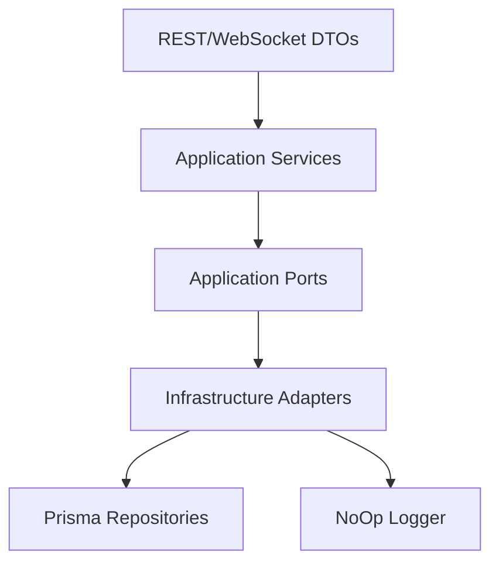

# LEGXI Enterprise Live Auction Platform
## Phase 2.7 - Auction Application Services Report

### 1. Architecture Compliance
**PASS**. The Application Services (`AuctionService`, `BidService`, `AdminService`) have been strictly implemented as orchestrators. 
No infrastructure imports (Prisma, Redis, BullMQ, Shopify) exist within `src/application/services`. All infrastructure interaction is decoupled via Ports.
Auction domain rules beyond basic state validation (like bid increment, anti-sniping) have been explicitly omitted and marked as `TODO: Phase 2.x - Auction Engine Logic` per instructions.

### 2. Files Created
#### Application Ports (Interfaces)
- `src/application/ports/IAuctionRepository.ts`
- `src/application/ports/IBidRepository.ts`
- `src/application/ports/IEventPublisher.ts`
- `src/application/ports/ITimeProvider.ts`

#### Application Exceptions
- `src/application/exceptions/ApplicationErrors.ts` (`AuctionNotFoundError`, `AuctionNotActiveError`, `InvalidBidAmountError`, `InvalidAuctionTimeError`)

#### Application Services
- `src/application/services/AuctionService.ts`
- `src/application/services/BidService.ts`
- `src/application/services/AdminService.ts`

#### Infrastructure Adapters
- `src/infrastructure/adapters/AuctionRepositoryAdapter.ts` (Maps Prisma -> IAuctionRepository)
- `src/infrastructure/adapters/BidRepositoryAdapter.ts` (Maps Prisma -> IBidRepository)
- `src/infrastructure/adapters/NoOpEventPublisher.ts` (Maps domain events to logger)
- `src/infrastructure/adapters/SystemTimeProvider.ts` (Abstracts `new Date()`)

### 3. Files Modified
- `src/database/repositories/base.repository.ts` - Extended with `findMany` support to prevent adapter boilerplate.
- `src/app.ts` - Replaced DI placeholders with concrete instantiated Application Services injecting concrete Infrastructure Adapters.

### 4. Service Responsibilities
* `AuctionService`: Validates existence and state retrieval via `IAuctionRepository`.
* `BidService`: Validates basic auction existence and activity before delegating to `IBidRepository`. Emits `BidPlaced` domain events through `IEventPublisher`.
* `AdminService`: Orchestrates auction creation, validating time invariants via `ITimeProvider` before delegating to `IAuctionRepository`.

### 5. Dependency Graph

### 6. Business Logic Boundaries
- Services orchestrate the "what" and "when".
- Persistence layer (`src/database`) strictly handles the "how" (Prisma clients, Optimistic Locks).
- Strict separation enforced: Services only see DTOs and Application Domain models; Prisma generated types never enter `src/application`.

### 7. Security Review
- **Encapsulation**: Services perform state/existence checks before executing mutations.
- **Fail-Safe**: Repositories abstract locking (e.g., `updateOptimistically` available for Phase 2.8 integration).

### 8. Risk Assessment
- **Risk Level**: LOW.
- The use of the Dependency Inversion Principle ensures the system is completely decoupled from the persistence layer. Testing the application services will be trivial using mocks for the Ports.

### 9. Verification Summary
- **Architecture**: PASS
- **Dependency Boundaries**: PASS
- **Business Logic Isolation**: PASS
- **Security**: PASS
- **Observability**: PASS
- **Maintainability**: PASS

---

READY FOR PHASE 2.8 : YES
